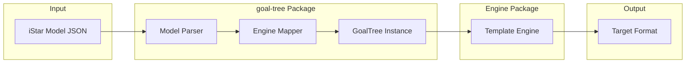
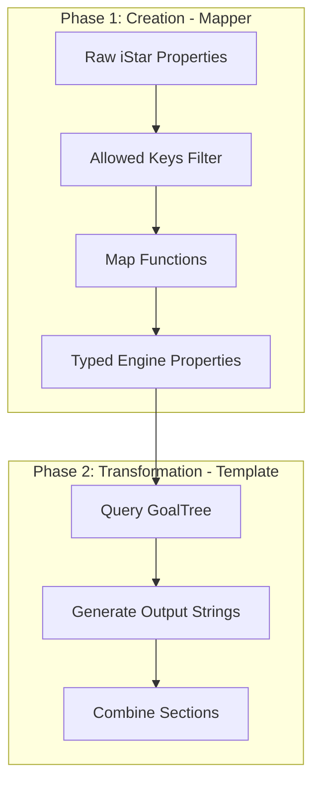
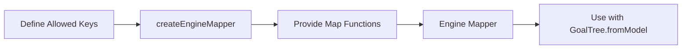
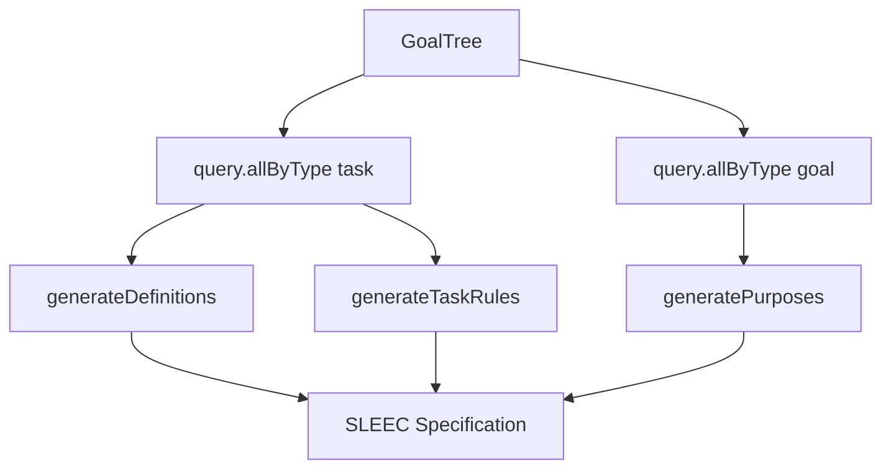

# goal-controller

[](https://github.com/vieirin/goal-controller/actions/workflows/prism-test.yaml)
[](https://github.com/vieirin/goal-controller/actions/workflows/test.yaml)

### FAQ

## Monorepo Structure

This repository is organized as a pnpm monorepo with the following structure:

```
goal-controller/
├── packages/
│   ├── lib/          # Core transformation engines (PRISM/SLEEC) + CLI tools
│   │   ├── src/
│   │   │   └── engines/               # Transformation engines
│   │   │       ├── edge/              # PRISM/Edge model generator
│   │   │       │   ├── mapper.ts      # iStar to Edge property mapper
│   │   │       │   ├── types.ts       # Edge-specific types
│   │   │       │   ├── template/      # PRISM model generation templates
│   │   │       │   ├── validator/     # PRISM model validation
│   │   │       │   ├── logger/        # Generation logging & metrics
│   │   │       │   └── mdp/           # MDP common utilities
│   │   │       └── sleec/             # SLEEC specification generator
│   │   │           ├── mapper.ts      # iStar to SLEEC property mapper
│   │   │           ├── types.ts       # SLEEC-specific types
│   │   │           └── template/      # SLEEC specification templates
│   │   └── out/      # Compiled JavaScript
│   ├── goal-tree/    # Goal model data structures
│   └── ui/           # Next.js web application for transformations
├── examples/         # Example goal models
├── experiments/      # Experiment infrastructure (Docker, scripts, metrics)
└── output/          # Generated PRISM/SLEEC models
```

### Transformation Engines

This repository includes two transformation engines for converting goal models:

1. **Edge/PRISM Engine** (`packages/lib/src/engines/edge/`) - Generates PRISM models for probabilistic verification
   - `mapper.ts` - Maps iStar model properties to Edge-specific properties
   - `template/` - Contains PRISM model generation templates
2. **SLEEC Engine** (`packages/lib/src/engines/sleec/`) - Generates SLEEC specifications for runtime monitoring
   - `mapper.ts` - Maps iStar model properties to SLEEC-specific properties
   - `template/` - Contains SLEEC specification templates
   - See [Transformation Example (SLEEC)](#transformation-example-sleec) section below for architecture and implementation details

---

## Engine Development Tutorial

This tutorial explains how to create new transformation engines for converting goal models to different target formats.

### Architecture Overview

The transformation system follows a **two-phase architecture**:



**Phase 1 - Creation (Mapper):** Transforms raw iStar properties into typed, engine-specific properties during tree construction.

**Phase 2 - Transformation (Template):** Generates output by querying the typed tree and combining generated sections.



### Creating a New Engine

Follow these steps to create a new transformation engine. We'll use SLEEC as a reference (simpler) and Edge for advanced patterns.



#### Step 1: Define Engine-Specific Types

The mapper transforms **raw string properties** from iStar into **rich typed structures**. Define types that represent your engine's domain model. See [`packages/lib/src/engines/sleec/types.ts`](packages/lib/src/engines/sleec/types.ts) and [`packages/lib/src/engines/edge/types.ts`](packages/lib/src/engines/edge/types.ts):

```typescript
// types.ts - Complex types transformed FROM raw iStar strings

// Nested structure parsed from "varName:3,otherVar:5" string
export type Decision = {
  hasDecision: boolean;
  decisionVars: Array<{ variable: string; space: number }>;
};

// Structured condition parsed from assertion strings
export type ExecCondition = {
  maintain?: { sentence: string; variables: string[] };
  assertion?: { sentence: string; variables: string[] };
};

export type MyEngineGoalProps = {
  priority: 'low' | 'normal' | 'high';  // Enum from string
  deadline: number | null;               // Number from string "300"
  decision: Decision;                    // Parsed from "var:3,other:5"
  execCondition?: ExecCondition;         // Parsed from assertion syntax
  dependsOn: GoalNode[];                 // Resolved node references
};

export type MyEngineTaskProps = {
  maxRetries: number;                    // Parsed from string "3"
  isOptional: boolean;                   // Parsed from string "true"
  tags: string[];                        // Parsed from "tag1,tag2,tag3"
  execCondition?: ExecCondition;
};
```

#### Step 2: Define Allowed Keys

Specify which iStar `customProperties` string keys your engine extracts. The mapper will receive these as `raw` strings:

```typescript
// mapper.ts
// These are the RAW string keys from iStar customProperties
export const MY_ENGINE_GOAL_KEYS = [
  'priority',      // Raw: "high" → Typed: 'high' (enum)
  'deadline',      // Raw: "300"  → Typed: 300 (number)
  'variables',     // Raw: "var:3,other:5" → Typed: Decision object
  'assertion',     // Raw: "x > 0 & y < 10" → Typed: ExecCondition
  'dependsOn',     // Raw: "G2,G3" → Typed: GoalNode[] (resolved in afterCreationMapper)
] as const;

export const MY_ENGINE_TASK_KEYS = [
  'maxRetries',    // Raw: "3" → Typed: 3 (number)
  'optional',      // Raw: "true" → Typed: true (boolean)
  'tags',          // Raw: "critical,async" → Typed: ["critical", "async"]
  'assertion',
] as const;
```

#### Step 3: Create the Engine Mapper

Transform raw strings into typed structures using parsing functions:

```typescript
import { createEngineMapper } from '@goal-controller/goal-tree';

// Parser: "var:3,other:5" → { hasDecision: true, decisionVars: [...] }
const parseDecision = (raw: string | undefined): Decision => {
  if (!raw) return { hasDecision: false, decisionVars: [] };
  
  const vars = raw.split(',').map(pair => {
    const [variable, space] = pair.split(':');
    return { variable: variable.trim(), space: parseInt(space, 10) };
  });
  
  return { hasDecision: vars.length > 0, decisionVars: vars };
};

// Parser: "low" | "normal" | "high" with validation
const parsePriority = (raw: string | undefined): 'low' | 'normal' | 'high' => {
  const valid = ['low', 'normal', 'high'] as const;
  return valid.includes(raw as any) ? (raw as 'low' | 'normal' | 'high') : 'normal';
};

export const myEngineMapper = createEngineMapper({
  allowedGoalKeys: MY_ENGINE_GOAL_KEYS,
  allowedTaskKeys: MY_ENGINE_TASK_KEYS,
  skipResource: true,
})({
  mapGoalProps: ({ raw }) => ({
    priority: parsePriority(raw.priority),           // "high" → 'high'
    deadline: raw.deadline ? parseInt(raw.deadline, 10) : null,  // "300" → 300
    decision: parseDecision(raw.variables),          // "var:3" → { hasDecision: true, ... }
    dependsOn: [],  // Resolved later in afterCreationMapper
  }),
  
  mapTaskProps: ({ raw }) => ({
    maxRetries: raw.maxRetries ? parseInt(raw.maxRetries, 10) : 0,  // "3" → 3
    isOptional: raw.optional === 'true',             // "true" → true
    tags: raw.tags ? raw.tags.split(',').map(t => t.trim()) : [],  // "a,b" → ["a","b"]
  }),
});
```

**Advanced: Cross-node references with `afterCreationMapper`**

For engines that need to resolve references between nodes (like Edge's `dependsOn`), see [`packages/lib/src/engines/edge/mapper.ts`](packages/lib/src/engines/edge/mapper.ts):

```typescript
afterCreationMapper: ({ node, allNodes, rawProperties }) => {
  if (rawProperties.type !== 'goal') return node.properties.engine;
  
  const depIds = parseDependsOn(rawProperties.raw.dependsOn);
  const resolvedDeps = depIds.map(id => allNodes.get(id));
  
  return { ...node.properties.engine, dependsOn: resolvedDeps };
}
```

#### Step 4: Create the Template Engine

Create functions that query the tree and generate output sections.

### Transformation Example (SLEEC)

This section demonstrates how to transform from a GoalTree using the SLEEC engine as an example.



#### Loading and Creating the Tree

```typescript
import { GoalTree, Model } from '@goal-controller/goal-tree';
import { sleecEngineMapper } from '@goal-controller/lib';

// Load from file
const model = Model.load('examples/goalModel-sleec.txt');
const tree = GoalTree.fromModel(model, sleecEngineMapper);

// Or from JSON string
const tree = GoalTree.fromJSON(jsonString, sleecEngineMapper);
```

#### Querying the Tree

Access typed engine properties through the query interface:

```typescript
// Get all tasks with typed engine properties
const tasks = tree.query.allByType('task');

tasks.forEach(task => {
  console.log(task.name);                              // "Track Vital Signs"
  console.log(task.properties.engine.PreCond);         // "{dataCollected}"
  console.log(task.properties.engine.TriggeringEvent); // "PatientAsleep"
  console.log(task.properties.engine.TemporalConstraint); // "300 seconds"
});

// Get all goals
const goals = tree.query.allByType('goal');

// Get leaf goals (goals with tasks, no child goals)
const leafGoals = tree.query.leafGoals();
```

#### generateDefinitions - Extract Events and Measures

This function extracts triggering events from task properties and generates SLEEC event definitions:

```typescript
import type { Task } from '@goal-controller/goal-tree';
import type { SleecTaskProps } from './types';

type SleecTask = Task<SleecTaskProps>;

const generateDefinitions = (tasks: SleecTask[]): string => {
  // Extract unique triggering events from typed task properties
  const events = tasks
    .map(task => task.properties.engine?.TriggeringEvent)
    .filter((event): event is string => !!event);
  
  const uniqueEvents = [...new Set(events)].sort();
  const eventLines = uniqueEvents
    .map(event => `    event ${event}`)
    .join('\n');

  // Extract boolean measures from PreCond/PostCond
  const measureRegex = /\{(\w+)\}/g;
  const measures = new Set<string>();
  
  tasks.forEach(task => {
    const conditions = [
      task.properties.engine?.PreCond,
      task.properties.engine?.PostCond,
    ].filter(Boolean);
    
    conditions.forEach(cond => {
      let match;
      while ((match = measureRegex.exec(cond!)) !== null) {
        measures.add(match[1]);
      }
    });
  });

  const measureLines = [...measures].sort()
    .map(m => `    measure ${m}: boolean`)
    .join('\n');

  return `def_start
${eventLines}

${measureLines}
def_end`;
};

// Example output:
// def_start
//     event DataCollected
//     event PatientAsleep
//     event MeetingUser
//
//     measure dataCollected: boolean
//     measure dataProcessed: boolean
// def_end
```

#### generateTaskRules - Generate Behavioral Rules

This function generates SLEEC rules from task properties:

```typescript
const generateTaskRules = (tasks: SleecTask[]): string => {
  const rules = tasks.map(task => {
    const { PreCond, TriggeringEvent, PostCond, TemporalConstraint } = 
      task.properties.engine;
    
    // Create fluent name from task name (remove spaces)
    const fluentName = task.name?.replaceAll(' ', '') || task.id;
    const ruleId = task.id.replace('.', '_');
    
    return `
    Rule${ruleId}_1 when ${TriggeringEvent} and ${PreCond} then Start${fluentName}
    Rule${ruleId}_2 when Start${fluentName} then Pursuing${fluentName} within ${TemporalConstraint}
    Rule${ruleId}_3 when Pursuing${fluentName} and ${PostCond} then Achieved${fluentName}`;
  }).join('\n');

  return `rule_start${rules}
rule_end`;
};

// Example output:
// rule_start
//     RuleT5_1 when PatientAsleep and {patientDiscomfort} then StartTrackVitalSigns
//     RuleT5_2 when StartTrackVitalSigns then PursuingTrackVitalSigns within 300 seconds
//     RuleT5_3 when PursuingTrackVitalSigns and {dataCollected} then AchievedTrackVitalSigns
// rule_end
```

#### generatePurposes - Generate Goal Purposes

This function generates purpose statements from goal properties:

```typescript
import { GoalTree, type GoalTreeType } from '@goal-controller/goal-tree';
import type { SleecGoalProps, SleecTaskProps } from './types';

type SleecGoalTree = GoalTreeType<SleecGoalProps, SleecTaskProps>;

const generatePurposes = (tree: SleecGoalTree): string => {
  const goals = GoalTree.allByType(tree, 'goal');
  
  const purposes = goals
    .filter(goal => 
      ['Achieve', 'Maintain'].includes(goal.properties.engine?.Type || '')
    )
    .map((goal, index) => {
      const { Condition, Event, ContextEvent, Type } = goal.properties.engine || {};
      
      if (!Condition || !Event || !ContextEvent) {
        throw new Error(`Goal ${goal.name} missing required properties`);
      }
      
      const label = `P${index + 1}`;
      
      if (Type === 'Achieve') {
        return `${label} when ${ContextEvent} and ${Condition} then ${Event}`;
      }
      // Maintain type
      return `${label} exists ${Event} and ${Condition} while ${ContextEvent}`;
    });

  return `purpose_start
  ${purposes.join('\n  ')}
purpose_end`;
};

// Example output:
// purpose_start
//   P1 when SystemActive and {emergencyDetected} then AlertMedicalStaff
// purpose_end
```

#### Complete Template Engine

Combine all generators into the final template engine:

```typescript
import { GoalTree, type GoalTreeType } from '@goal-controller/goal-tree';
import type { SleecGoalProps, SleecTaskProps } from './types';

export const sleecTemplateEngine = (
  tree: GoalTreeType<SleecGoalProps, SleecTaskProps>
): string => {
  const tasks = GoalTree.allByType(tree, 'task');
  
  const definitions = generateDefinitions(tasks);
  const rules = generateTaskRules(tasks);
  const purposes = generatePurposes(tree);
  
  return `${definitions}

${rules}

${purposes}`;
};

// Usage:
const model = Model.load('examples/goalModel-sleec.txt');
const tree = GoalTree.fromModel(model, sleecEngineMapper);
const sleecSpec = sleecTemplateEngine(tree.nodes);

console.log(sleecSpec);
```

#### Sample Complete Output

```sleec
def_start
    event DataCollected
    event MeetingUser
    event PatientAsleep
    event PatientOutdoors

    measure dataCollected: boolean
    measure dataProcessed: boolean
    measure patientDiscomfort: scale(low, moderate, high)
def_end

rule_start
    RuleT5_1 when PatientAsleep and {patientDiscomfort} then StartTrackVitalSigns
    RuleT5_2 when StartTrackVitalSigns then PursuingTrackVitalSigns within 300 seconds
    RuleT5_3 when PursuingTrackVitalSigns and {dataCollected} then AchievedTrackVitalSigns

    RuleT7_1 when DataCollected and {dataSaved} then StartProcessData
    RuleT7_2 when StartProcessData then PursuingProcessData within 60 seconds
    RuleT7_3 when PursuingProcessData and {dataProcessed} then AchievedProcessData
rule_end

purpose_start
  P1 when SystemActive and {emergencyDetected} then AlertMedicalStaff
purpose_end
```

---

### Quick Start

1. **Install dependencies:**
   ```bash
   pnpm install
   ```

2. **Generate ANTLR parsers:**
   ```bash
   make grammar
   ```

3. **Build the library:**
   ```bash
   pnpm run build:lib
   ```

4. **Run transformations:**
   ```bash
   make run FILE=examples/simpleChoice.txt
   ```

5. **Launch the web UI:**
   ```bash
   pnpm run dev:ui
   # Open http://localhost:3000
   ```

## How to execute this repo?

### Installation

#### Alternative 1: VScode integrated environment (Recommended)

1. Open the repo on a new VSCode window
1. Make sure you have docker installed
1. Install the [devcontainer](https://marketplace.visualstudio.com/items?itemName=ms-vscode-remote.remote-containers) extension, more info about it [here](https://code.visualstudio.com/docs/devcontainers/containers)
1. A dialog will ask you to reopen the repo in a container, accept it and wait for the build to finish
1. Once inside the dev container environment, you can use:
   - `make exec` to run the translator with the default example
   - `make cli` to launch the interactive CLI
   - `make cli-clean` to launch the interactive CLI with the `--clean` flag (skips preserving old System module transitions)

##### Alternative 2: Run manually from any terminal

1. **Install pnpm:**
   ```bash
   npm install -g pnpm
   ```

2. **Install antlr4:**
   - `pip install antlr4-tools`
   - `brew install antlr` (MacOS, check how to install for your distribution)

3. **Install Node.js 22.6.0:**
   ```bash
   # Using nvm
   curl -o- https://raw.githubusercontent.com/nvm-sh/nvm/v0.39.7/install.sh | bash
   nvm install 22.6.0
   nvm use 22.6.0
   ```

4. **Install dependencies:**
   ```bash
   pnpm install
   ```

### Execution

#### Interactive CLI

You can use the interactive CLI to select and run models:

- `make cli` - Launches the interactive CLI
- `make cli-clean` - Launches the interactive CLI with the `--clean` flag (generates clean System modules without preserving old transitions)

#### Generating the PRISM model

1. Build the library package first:
   ```bash
   make grammar  # Generate ANTLR parsers
   pnpm run build:lib  # Build the library
   ```

2. Generate the model using one of these methods:

   **Using Makefile (Recommended):**
   ```bash
   make run FILE=examples/simpleChoice.txt
   # or
   make generate FILE=examples/simpleChoice.txt
   ```

   **Using Node directly:**
   ```bash
   node packages/lib/out/index.js examples/simpleChoice.txt
   ```

   Where `$GOAL_MODEL_FILE` is the downloaded goal model from [pistar](https://www.cin.ufpe.br/~jhcp/pistar/tool/#).
   
   **Note:** The `--clean` flag is not currently supported in the CLI entry point. Use the interactive CLI (`make cli`) for clean mode.
2. If successful you should see the string `The file was saved!` in the terminal.
3. Add the goal model to the goalmngt folder
   - `cp $GOAL_MODEL_FILE goalmgmt/edgeModel.txt`
   - E.g: `cp examples/edgeModel.txt goalmgmt/edgeModel.txt`

##### System Module Transition Preservation

By default, when generating a PRISM model, the System module will automatically preserve transitions from a previously generated PRISM file (if it exists in the `output/` directory). This allows you to maintain custom transitions in the System module across model regenerations.

**How it works:**

- When generating a PRISM model, the system looks for an existing PRISM file with the same base name in the `output/` directory
- If found, it extracts all transition lines (including any preceding comments) from the System module
- These transitions are then included in the newly generated System module alongside the automatically generated context and resource variables

**Example:**
If you have a file `output/myModel.prism` with custom System module transitions:

```prism
module System
  myVar: bool init false;

  // Custom transition
  [achieved_T1] true -> (myVar'=true);
endmodule
```

When you regenerate the model, these transitions will be preserved in the new System module.

**Using the `--clean` flag:**
To skip this behavior and generate a completely fresh System module without preserving old transitions, use the `--clean` or `-c` flag:

**Make targets:**

```bash
make cli-clean  # Interactive CLI with --clean flag
```

**Note:** The direct command-line `--clean` flag is not available. Use the interactive CLI for clean mode.

This is useful when you want to start with a clean System module or when the old transitions are no longer relevant.

This process outputs a file in `output/<file>.prism` this is the MDP input for the PRISM model checker. To generate the controller and states files please refer to the [EDGE specification](https://github.com/Genaina/Formalise23/tree/main?tab=readme-ov-file#instructions-to-synthesize-the-edge-goal-controller)

## Running Experiments

This section describes how to run experiments to collect metrics and analyze the performance of goal model translations.

### Prerequisites

- Docker and Docker Compose installed
- The experiment Docker container (built automatically on first run)

### Step-by-Step Guide

#### 1. Add the Goal Model

Add your goal model file (`.txt` format) to the `examples/experiments/` directory:

```bash
cp your-goal-model.txt examples/experiments/your-goal-model.txt
```

The goal model should be in the PiStar format, as exported from the [PiStar tool](https://www.cin.ufpe.br/~jhcp/pistar/tool/#).

#### 2. Add PCTL Properties

Create a properties file (`.props` format) with PCTL formulas to verify against your model. Place it in `examples/experiments/props/`:

```bash
# Create the props directory if it doesn't exist
mkdir -p examples/experiments/props

# Add your properties file
# The filename should match your goal model name (e.g., if your model is "myModel.txt",
# create "myModel.props")
cp your-properties.props examples/experiments/props/your-goal-model.props
```

**Example properties file format:**

```prism
// Example properties for goal model verification
P=? [F "goal_achieved"]
P>=0.9 [G "system_safe"]
```

#### 3. Launch the Experiment Container

Start the Docker container with all necessary dependencies:

```bash
make experiment
```

This command will:

- Build the experiment Docker image (if not already built)
- Start the container in detached mode
- Open an interactive bash session inside the container

The container includes:

- Node.js 22.6.0
- Storm model checker
- Python 3 with required packages
- All project files mounted at `/workspace`

#### 4. Run the Experiment

Inside the Docker container, run the experiment pipeline:

```bash
make run-experiment
```

This command executes the following steps:

1. **Generate PRISM models**: Converts all goal models in `examples/experiments/` to PRISM format
2. **Check properties**: Validates all properties using Storm model checker
3. **Extract metrics**: Collects performance and model statistics

The results are saved to:

- PRISM models: `output/*.prism`
- Property check results: `examples/experiments/props/results/*.result.storm`
- Metrics: `metrics.csv`

#### 5. Collect the Data

Exit the Docker container (type `exit` or press `Ctrl+D`) and collect the results:

**Metrics CSV file:**
The `metrics.csv` file contains comprehensive metrics for each model, including:

- Translation time and memory usage
- Model structure (goals, tasks, resources, nodes, variables)
- PRISM model characteristics (states, transitions, lines)
- Model checking performance (parsing time, construction time, checking time)
- Memory and CPU usage

**View the metrics:**

```bash
cat metrics.csv
# or
head -n 20 metrics.csv
```

#### 6. Plot the Results

Use the provided Python script to visualize the collected metrics:

**Display plots interactively:**

```bash
python3 experiments/plot_metrics.py
```

**Save plots as PNG files:**

```bash
python3 experiments/plot_metrics.py --save
```

**Save to a custom directory:**

```bash
python3 experiments/plot_metrics.py --save --output-dir result_plots
```

**View statistics:**

```bash
# Display min/max statistics for all metrics
python3 experiments/plot_metrics.py --stats

# Display relationship statistics for total_nodes
python3 experiments/plot_metrics.py --relationships
```

**Customize the plots:**
You can modify `experiments/plot_metrics.py` to:

- Add new metrics to visualize
- Change plot types (scatter, line, bar, etc.)
- Adjust plot styling and labels
- Add regression analysis or trend lines

### Experiment Workflow Summary

```bash
# 1. Add your files
cp my-model.txt examples/experiments/
cp my-properties.props examples/experiments/props/my-model.props

# 2. Launch container
make experiment

# 3. Inside container: run experiment
make run-experiment

# 4. Exit container
exit

# 5. View results
cat metrics.csv

# 6. Plot results
python3 experiments/plot_metrics.py --save
```

### Troubleshooting

**Container won't start:**

- Ensure Docker is running: `docker ps`
- Check if container already exists: `docker ps -a | grep experiment-container`
- Remove old container: `docker rm experiment-container`

**Experiment fails:**

- Check that goal model files are valid PiStar format
- Verify properties files are in correct PCTL syntax
- Check container logs: `docker logs experiment-container`

**Missing dependencies:**

- The container should have all dependencies pre-installed
- If issues occur, rebuild: `docker-compose -f experiments/docker-compose.storm.yml build experiment`

### Additional Resources

- [PRISM Model Checker Documentation](https://www.prismmodelchecker.org/manual/)
- [Storm Model Checker Documentation](https://www.stormchecker.org/)
- [PCTL Property Specification](https://www.prismmodelchecker.org/manual/PropertySpecification/PropertiesFiles)
